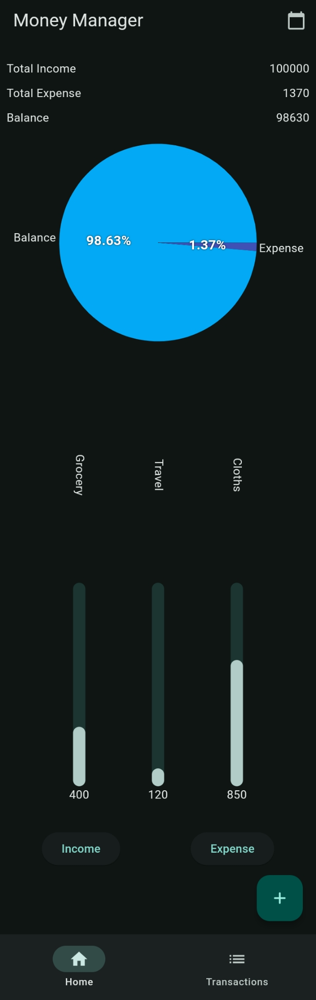
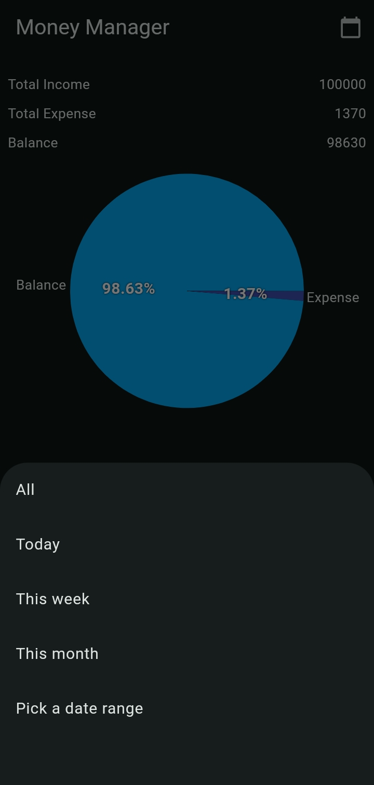
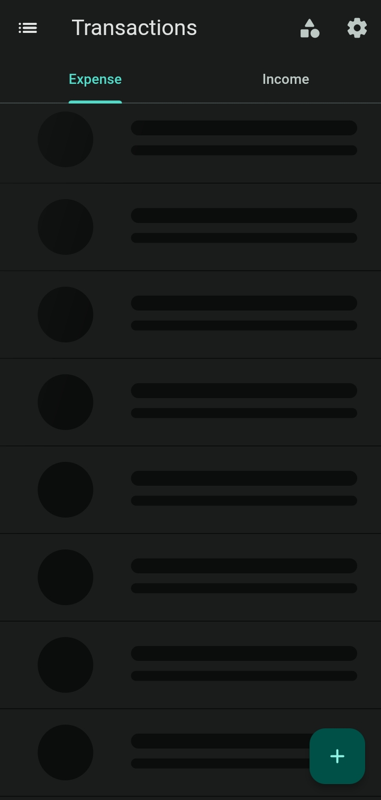
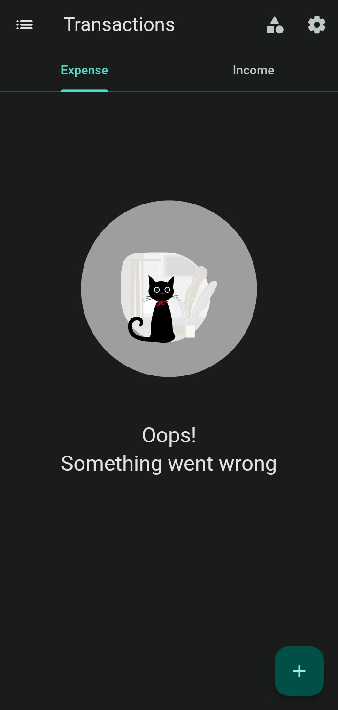
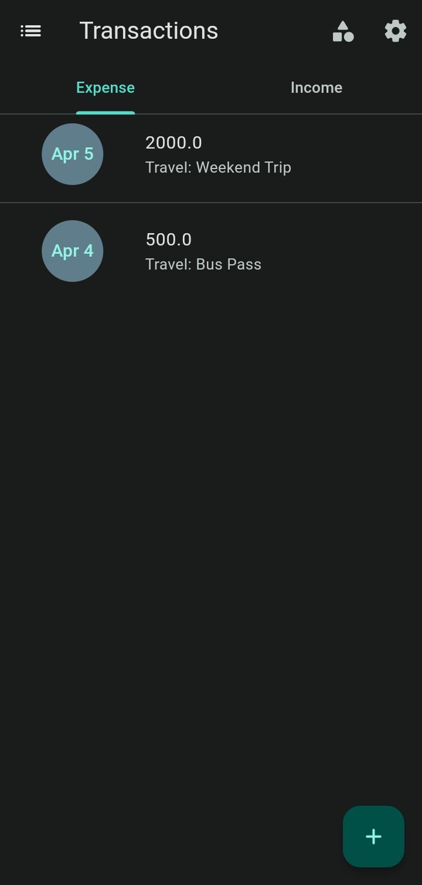
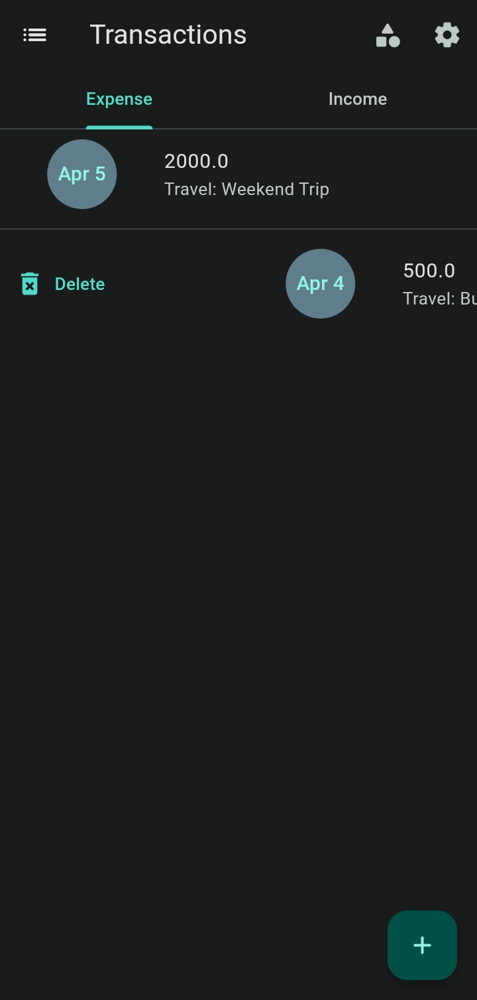
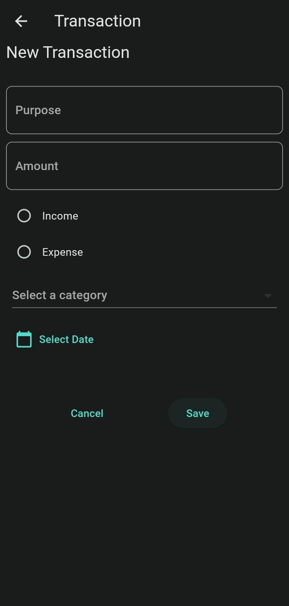
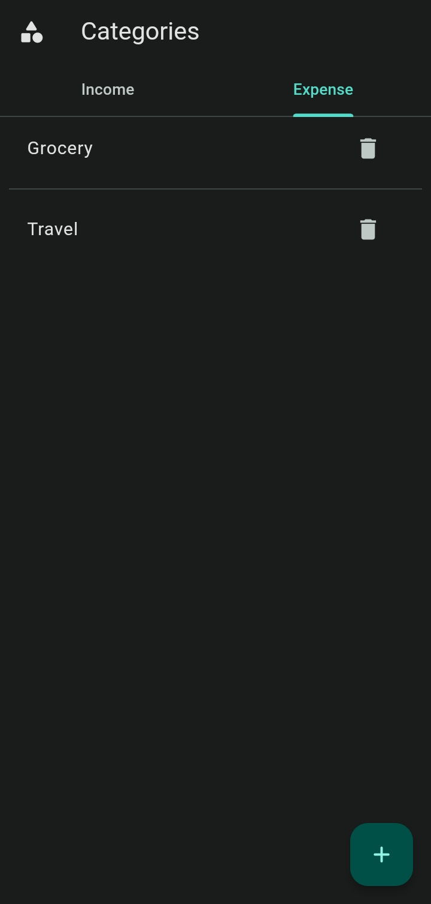
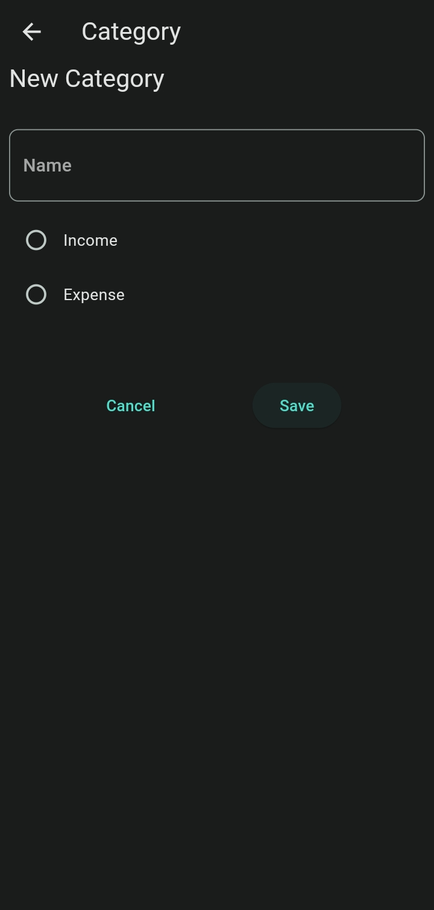
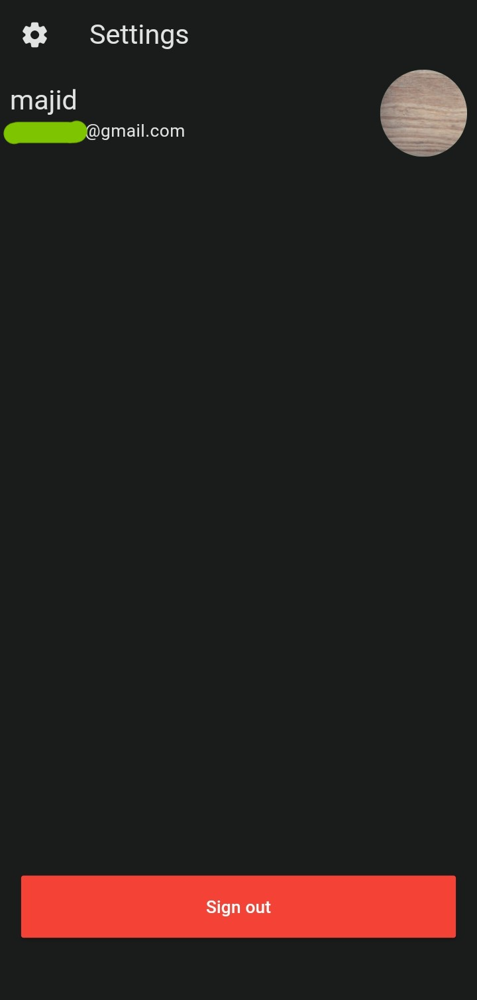

# Money Manager

- A basic money manager CRUD (Create, Read, Update, Delete) flutter app.
- It provides a basic analysis of transactions using charts.
- Built with [Firebase] Auth (Google Sign in) and Firestore.
- Utilized [Bloc] for effective state management.
- Follows the Clean architecture.

## Running the project

- Clone the repository
-  Get the packages
```bash
cd money_manager
flutter pub get
```

- Create a new [Firebase] project.
- Enable the Google sign-in method in the authentication section.
- Provide the SHA-1 fingerprint / key.
- [Install and initialize the Firebase SDKs for Flutter]

-  Run the app

```bash
flutter run
```


 Note : *The application was run on Android while in development and was not tested on iOS.*
 ## Screenshots
 <p align="center">
  
  <br>
  
  <br>
  
  
  
    
  
  
  
  
  
</p>

[Install and initialize the Firebase SDKs for Flutter]: <https://firebase.google.com/docs/flutter/setup?platform=android>
[Firebase]: <https://console.firebase.google.com/>
[Bloc]:<https://pub.dev/packages/flutter_bloc>